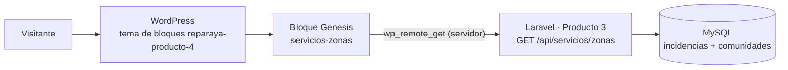

# ReparaYa · Producto 4

## Web institucional en WordPress (FSE) conectada al Web Service del Producto 3

**Asignatura:** FP.448 - Desarrollo back-end con PHP, framework MVC y gestión de contenidos  
**Institución:** Universitat Oberta de Catalunya (UOC)  
**Grupo:** BackLord  
**Producto:** Producto 4  
**Repositorio:** ReparaYa-Producto4-WordPress  
**Rama de integración:** `Develop` · **Rama estable de entrega:** `main`

### Integrantes

- Erick Coll Rodríguez
- Carles Miguel Millán
- Miguel Alegre Zaragoza

---

## 1. Descripción general

El **Producto 4** añade a ReparaYa su **web institucional**: un sitio WordPress construido con un **tema de bloques propio (Full Site Editing)** que presenta la empresa, sus servicios, su flota técnica y sus noticias.

La web no es un escaparate aislado: la página **Nuestros servicios** reserva una sección para el bloque dinámico **Servicios por zona**, que consulta en el servidor el **Web Service REST del Producto 3** (`/api/servicios/zonas`, aplicación Laravel) y muestra los servicios finalizados agrupados por zona. El bloque se crea con el plugin Genesis Custom Blocks (ver el [apartado 7](#7-puesta-en-marcha-en-local)).

| Producto | Qué aporta | Repositorio |
|:--|:--|:--|
| Producto 2 | Aplicación de gestión de incidencias en PHP sin framework (MVC propio) | [ReparaYa-Producto2](https://github.com/EricKColl/ReparaYa-Producto2) |
| Producto 3 | Migración a Laravel 12, bloque B2B y API REST `/api/servicios/zonas` | [ReparaYa-Producto3-Laravel](https://github.com/EricKColl/ReparaYa-Producto3-Laravel) |
| **Producto 4** | **Web institucional en WordPress con tema de bloques y bloque conectado a la API** | **este repositorio** |

---

## 2. Arquitectura



- La petición al Web Service se hace **desde el servidor** con `wp_remote_get`, no desde el navegador: no hace falta configurar CORS en Laravel.
- El bloque elige el endpoint según el entorno:
  - **En local** (host con `localhost`, `127.0.0.1` o `:8084`): prueba primero `http://host.docker.internal:8000/api/servicios/zonas` (3 s de timeout) y, si falla, el endpoint de la UOC.
  - **En cualquier otro host:** usa directamente `https://fp064.techlab.uoc.edu/~uocx3/producto3/api/servicios/zonas` (12 s de timeout).
  - La constante o variable de entorno `REPARAYA_SERVICIOS_ZONAS_ENDPOINT` fuerza un endpoint concreto (con 12 s de timeout y sin endpoint de reserva).
- Si ningún endpoint responde con un JSON válido, el bloque muestra un aviso en lugar de romper la página.

---

## 3. La web institucional

El tema **ReparaYa** (`wordpress/wp-content/themes/reparaya-producto-4`) tiene una identidad negra y dorada. `theme.json` define la paleta, la tipografía base y el ancho del contenido; cada página principal se maqueta con HTML y CSS propios dentro de bloques `wp:html`, y las plantillas genéricas muestran el contenido del editor.

| Página | Plantilla | Contenido |
|:--|:--|:--|
| **Inicio** | `templates/front-page.html` | Hero con mensajes rotativos, presentación en vídeo, soluciones por tipo de cliente, servicios destacados en pestañas, proceso de trabajo y áreas de servicio |
| **Nuestros servicios** | `templates/page-nuestros-servicios.html` | Reparación urgente, mantenimiento preventivo, diagnóstico técnico y atención a empresas (cada uno con su vídeo), soluciones por cliente, proceso y garantía, preguntas frecuentes y el bloque **Servicios por zona** |
| **Flota técnica** | `templates/page-nuestra-flota.html` | Núcleo operativo, equipo técnico, vehículos de intervención, herramientas y coordinación del servicio |
| **Noticias** | `templates/home.html` | Contenido editorial fijo: artículo destacado, últimas publicaciones y línea editorial |
| Páginas y entradas genéricas | `page.html`, `single.html`, `index.html` | Título y contenido del editor |

Todas comparten cabecera fija (`parts/header.html`) con navegación y botón **Solicitar reparación**, y pie de contacto (`parts/footer.html`). Las cuatro páginas principales incluyen el formulario modal de solicitud de reparación que abre ese botón.

### Decisiones técnicas del tema

- **Rutas válidas en local y en la UOC:** las plantillas escriben las rutas desde la raíz (`/wp-content/themes/...`, `/nuestros-servicios/`). `functions.php` las reescribe en la salida con `get_template_directory_uri()` y `home_url()`, para que las mismas plantillas funcionen en `localhost:8084` y bajo `/~uocx3/` en el servidor de la UOC.
- **Cabecera ligera:** se eliminan del `<head>` el generador, los enlaces REST y oEmbed y los scripts de emojis, y se precarga el logotipo.
- **Recursos propios:** CSS y JS del tema versionados por fecha de modificación (`filemtime`), fuentes de Google Fonts (Orbitron, Rajdhani, Cinzel y Share Tech Mono), imágenes y vídeos en `assets/`.

---

## 4. Integración con el Producto 3

### 4.1. Endpoint consumido

```text
GET https://fp064.techlab.uoc.edu/~uocx3/producto3/api/servicios/zonas
```

Lo implementa `ApiController::serviciosPorZona` en la aplicación Laravel (`laravel/app/Http/Controllers/ApiController.php`): cuenta las incidencias **finalizadas** asociadas a una comunidad, las agrupa por `comunidades.zona` y devuelve:

```json
{
    "total_global": 2,
    "zonas": [
        { "zona": "Norte", "total_servicios": 2, "porcentaje": 100 }
    ]
}
```

> Los valores del ejemplo corresponden a los datos de `bbddReparaYa.sql`.

### 4.2. Bloque `servicios-zonas`

- Plantilla del bloque: `blocks/servicios-zonas/block.php` (con `blocks/block-servicios-zonas.php` como plantilla alternativa), siguiendo la convención de plantillas del plugin **Genesis Custom Blocks**.
- Pinta una tarjeta resumen con el total global y una tarjeta por zona con su número de servicios y el porcentaje sobre el total.
- Toda la salida se escapa con `esc_html`/`esc_url`.
- La plantilla `page-nuestros-servicios.html` reserva la sección **Integración dinámica · Producto 3** y muestra en ella el contenido de la página, que es donde se inserta el bloque desde el editor.

---

## 5. Tecnologías

- WordPress 6.6 o superior (imagen oficial `wordpress:latest`) con **tema de bloques / Full Site Editing** (`theme.json` v3)
- PHP 8.0 o superior · HTML · CSS · JavaScript
- Genesis Custom Blocks (bloque dinámico)
- WP-CLI (imagen `wordpress:cli`) para crear la estructura del sitio
- MySQL 8 · phpMyAdmin
- Docker y Docker Compose
- Laravel 12 (Producto 3) como origen de datos
- Git y GitHub con flujo `feature → Develop → main`

---

## 6. Estructura del repositorio

```text
ReparaYa-Producto4-WordPress/
├── wordpress/
│   └── wp-content/themes/reparaya-producto-4/   # Tema de bloques del Producto 4 (lo único versionado de WordPress)
│       ├── theme.json · style.css · functions.php
│       ├── templates/      # front-page, home, page, single, index, nuestros-servicios, nuestra-flota
│       ├── parts/          # header y footer
│       ├── blocks/         # bloque servicios-zonas (Genesis Custom Blocks)
│       └── assets/         # css, js, img y video
├── scripts/
│   └── crear-estructura-wordpress.sh   # Páginas, portada, página de entradas y noticias con WP-CLI
├── docker-compose.yml                  # Entorno del Producto 4: WordPress, MySQL y phpMyAdmin
├── docker-compose.producto3.backup.yml # Entorno del Producto 3, conservado como referencia
├── Dockerfile.web · Dockerfile.laravel-web   # Imágenes usadas por el entorno del Producto 3
├── laravel/                # Aplicación Laravel del Producto 3 (referencia local de la API)
├── src/                    # Aplicación PHP MVC del Producto 2 (legado)
└── bbddReparaYa.sql        # Base de datos del Producto 3
```

El núcleo de WordPress, `wp-config.php`, los plugins de terceros y las subidas no se versionan (ver `.gitignore`): Docker y WordPress generan los primeros, y los plugins se instalan desde el panel.

---

## 7. Puesta en marcha en local

Requisitos: Docker con Docker Compose y una terminal Bash (Linux, macOS o WSL) para el script de WP-CLI.

1. **Levantar el entorno** desde la raíz del repositorio:

   ```bash
   docker compose up -d
   ```

   | Servicio | Contenedor | URL |
   |:--|:--|:--|
   | WordPress | `p4-wordpress` | http://localhost:8084 |
   | phpMyAdmin | `p4-phpmyadmin` | http://localhost:8085 |
   | MySQL | `p4-wp-db` | (sin puerto publicado, base de datos `wp_producto4`) |

2. **Instalar WordPress** desde http://localhost:8084 (asistente de instalación).
3. **Activar el tema** *ReparaYa* en *Apariencia → Temas*. Usar enlaces permanentes distintos de *Simple*, ya que la navegación enlaza a `/nuestros-servicios/`, `/nuestra-flota/` y `/noticias/`.
4. **Crear la estructura del sitio** con WP-CLI (con `p4-wordpress` en marcha y desde la raíz del repositorio):

   ```bash
   bash scripts/crear-estructura-wordpress.sh
   ```

   El script crea o actualiza las páginas *Home*, *Nuestros servicios*, *Nuestra flota* y *Noticias*, fija *Home* como portada y *Noticias* como página de entradas, y publica tres noticias. Localiza cada página y entrada por su slug, pero **al volver a ejecutarlo sobrescribe su contenido**, incluido el bloque insertado en el paso 5.

5. **Bloque Servicios por zona:**
   1. Instalar el plugin **Genesis Custom Blocks** y crear un bloque con el slug `servicios-zonas`. El plugin encuentra solo la plantilla del tema (`blocks/servicios-zonas/block.php`).
   2. Editar la página *Nuestros servicios*, sustituir el texto provisional que deja el script por el bloque y publicar.
   3. Sin una API local en el puerto 8000, el bloque usa el endpoint publicado en la UOC.

6. **API local del Producto 3** (opcional). Se levanta con el entorno de referencia, como proyecto Compose separado:

   ```bash
   # Base de datos y dependencias de Laravel
   docker compose -p producto3 -f docker-compose.producto3.backup.yml up -d db
   docker compose -p producto3 -f docker-compose.producto3.backup.yml run --rm laravel composer install

   # Configuración: en laravel/.env usar DB_CONNECTION=mysql, DB_HOST=db, DB_PORT=3306,
   # DB_DATABASE=appdb, DB_USERNAME=appuser y DB_PASSWORD=apppass
   cp laravel/.env.example laravel/.env
   docker compose -p producto3 -f docker-compose.producto3.backup.yml run --rm laravel-web php artisan key:generate

   # Datos (cuando MySQL haya terminado de arrancar) y API
   docker exec -i daw-db mysql -uappuser -papppass appdb < bbddReparaYa.sql
   docker compose -p producto3 -f docker-compose.producto3.backup.yml up -d laravel-web
   ```

   La API responde en http://localhost:8000/api/servicios/zonas y WordPress la usa automáticamente. Para fijar otro endpoint, añadir `REPARAYA_SERVICIOS_ZONAS_ENDPOINT` al `environment` del servicio `p4-wordpress` y volver a ejecutar `docker compose up -d`.

---

## 8. Despliegue en el servidor UOC

El tema está preparado para publicarse bajo `/~uocx3/` en `fp064.techlab.uoc.edu`: la reescritura de rutas de `functions.php` adapta enlaces y recursos al subdirectorio sin cambiar las plantillas. El script de WP-CLI solo funciona con el entorno Docker local, así que en el servidor la estructura se crea desde el panel:

1. Subir `wp-content/themes/reparaya-producto-4` a la instalación de WordPress y activar el tema.
2. Configurar enlaces permanentes distintos de *Simple*.
3. Crear las páginas con los slugs `home`, `nuestros-servicios`, `nuestra-flota` y `noticias`, y en *Ajustes → Lectura* fijar *Home* como portada y *Noticias* como página de entradas.
4. Instalar Genesis Custom Blocks, crear el bloque `servicios-zonas` e insertarlo en *Nuestros servicios*.

En el servidor, el bloque consulta directamente el Web Service del Producto 3:

```text
https://fp064.techlab.uoc.edu/~uocx3/producto3/api/servicios/zonas
```

---

## 9. Flujo de trabajo

- `main`: versión estable y entregable.
- `Develop`: integración de las ramas de trabajo.
- Ramas de funcionalidad (`Erick---feature/*`), integradas en `Develop` mediante Pull Request y después en `main`.

| Rama | Pull Request | Contenido |
|:--|:--|:--|
| `Erick---feature/configuracion-wordpress-base` | #1 | Tema base de bloques del Producto 4 |
| `Erick---feature/estructura-paginas-wordpress` | #3 | Rediseño de la web institucional |
| `Erick---feature/genesis-json-servicios` | #5 | Bloque Genesis conectado al JSON de servicios |
| `Erick---feature/preparacion-local-uoc-genesis` | #7 | Preparación del bloque para local y UOC |
| `Erick---feature/preparacion-final-despliegue-uoc` | #9 | Normalización de rutas del tema para el despliegue en la UOC |

Cada rama se integró en `Develop` y, a continuación, `Develop` en `main` (Pull Requests #2, #4, #6, #8 y #10).

---

## 10. Limitaciones conocidas

- **Formularios sin backend:** los formularios de solicitud de reparación son de presentación: envían por `GET` (a la propia página o, desde Inicio, a *Nuestros servicios*) y no guardan las solicitudes.
- **Noticias fijas:** la página *Noticias* muestra contenido editorial escrito en la plantilla; las entradas publicadas en WordPress tienen su propia URL, pero no aparecen en ese listado.
- **Plugin fuera del repositorio:** el bloque dinámico depende de Genesis Custom Blocks, que no se versiona; la definición del bloque se guarda en la base de datos de WordPress.
- **Sin caché:** la consulta al Web Service se repite en cada visita a *Nuestros servicios*.
- **Vídeos pesados:** los siete vídeos del tema (unos 75 MB) están en el repositorio sin Git LFS, por lo que la primera clonación es lenta.
